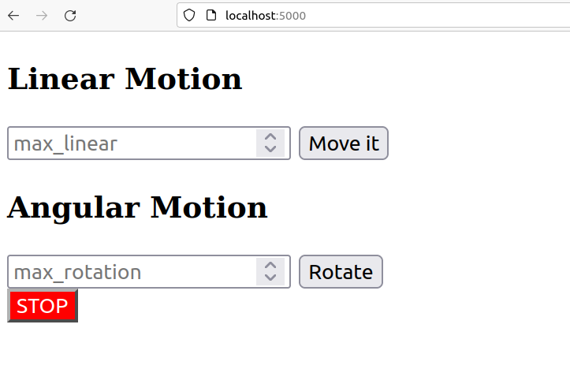
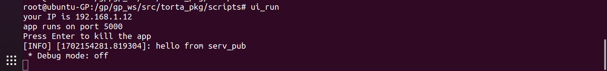

# Simple ROS UI
This is a simplified web GUI to send commands to the robot.


## Usage
The commands to use the app are rather long and technical so they are listed here for completenes, it is recommended to use the accompanying script to access the UI and all its functionalities.

## Manual commands
Note that all the commands here need to be run as root or using `sudo`

To run the application

```bash
cd /gp/gp_ws/src/torta_pkg/scripts/
flask run --no-reload --host 0.0.0.0
```

To kill the application you might be tempted to use `^c` but that will not work, instead you must find the PID of the app
```bash
ps -a | grep flask
```

To kill the app
```bash
kill -9 PID
```

## Script
Entering these commands manually can be annoying so I have made a script that you can run from any directory on the system as there is a link refering to it by the name `ui_run`

So you can start the app by simply running
```bash
sudo ui_run
```
This will give you all the data you need to access the app (IP address and port). And when you want to kill the app simply press enter.


